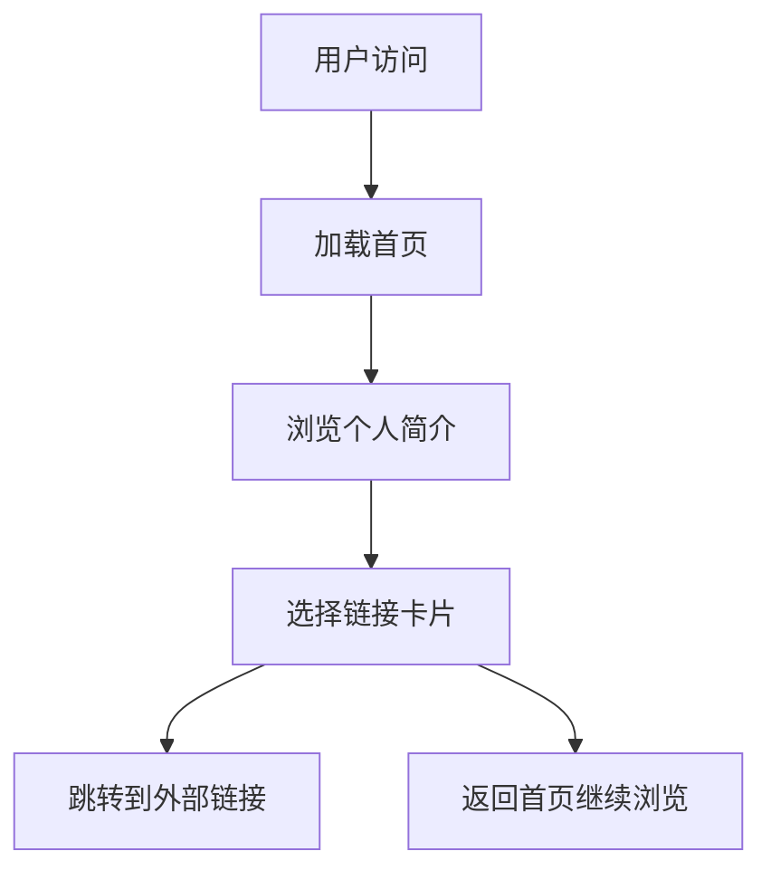

## 1. 产品概述
本项目是一个现代化的个人首页链接中心，作为个人品牌展示和项目导航的核心页面。用户可以通过这个页面快速访问个人博客、GitHub主页以及其他个人开发的小工具和项目。

目标用户为开发者和技术爱好者，通过精美的界面设计和流畅的用户体验，展示个人技术实力和项目成果。

## 2. 核心功能

### 2.1 用户角色
本项目为个人展示页面，无需用户注册和登录功能，所有访问者均为匿名用户，享有相同的浏览权限。

| 角色 | 访问方式 | 核心权限 |
|------|----------|----------|
| 匿名访问者 | 直接访问 | 浏览所有链接卡片、访问外部链接 |

### 2.2 功能模块
个人首页链接中心包含以下主要页面：
1. **首页**：展示个人头像、简介和多个链接卡片。
2. **项目详情页**（可选）：展示具体项目的详细介绍和使用说明。

### 2.3 页面详情
| 页面名称 | 模块名称 | 功能描述 |
|----------|----------|----------|
| 首页 | 个人简介区 | 显示个人头像、姓名、职业头衔和简短介绍 |
| 首页 | 链接卡片区 | 展示多个可点击的卡片，每个卡片包含图标、标题、描述和跳转链接 |
| 首页 | GitHub卡片 | 特殊样式的卡片，链接到https://github.com/szysammie |
| 首页 | 博客卡片 | 特殊样式的卡片，链接到https://blog.sammie.vip |
| 首页 | 工具卡片 | 可扩展的卡片组，用于展示个人开发的小工具 |
| 首页 | 页脚 | 显示版权信息和联系方式 |

## 3. 核心流程
用户访问流程：
1. 用户访问首页，看到个人简介和链接卡片
2. 用户点击任意卡片，跳转到对应的外部链接
3. 页面支持响应式布局，适配不同设备尺寸

## 4. 用户界面设计

### 4.1 设计风格
- **主色调**：渐变背景（从深蓝到紫色或从青色到粉色的现代渐变）
- **按钮样式**：圆角矩形，悬停时有轻微阴影效果
- **字体**：现代无衬线字体，标题使用较大字号（24-32px），正文使用中等字号（16px）
- **布局风格**：卡片式布局，网格系统排列
- **图标风格**：使用Element Plus图标库，保持简洁现代风格

### 4.2 页面设计概览
| 页面名称 | 模块名称 | UI元素 |
|----------|----------|--------|
| 首页 | 个人简介区 | 圆形头像(120px)、姓名(28px)、职业头衔(18px)、简介文字(16px)，居中布局 |
| 首页 | 链接卡片区 | 网格布局(桌面端3列，平板2列，手机1列)，卡片间距20px，卡片圆角12px |
| 首页 | GitHub卡片 | 特殊标识，使用GitHub品牌色，包含GitHub图标 |
| 首页 | 博客卡片 | 使用博客相关图标，简洁设计风格 |
| 首页 | 工具卡片 | 统一的卡片样式，包含工具图标、标题和简短描述 |
| 首页 | 页脚 | 简洁的版权信息，使用较小字号(14px) |

### 4.3 响应式设计
- **桌面端**：1200px以上，3列卡片布局
- **平板端**：768px-1199px，2列卡片布局
- **手机端**：767px以下，1列卡片布局
- **触摸优化**：卡片点击区域足够大，支持触摸操作

### 4.4 交互动效
- 页面加载时的淡入动画
- 卡片悬停时的轻微放大和阴影效果
- 点击卡片时的反馈动画
- 平滑的页面滚动效果