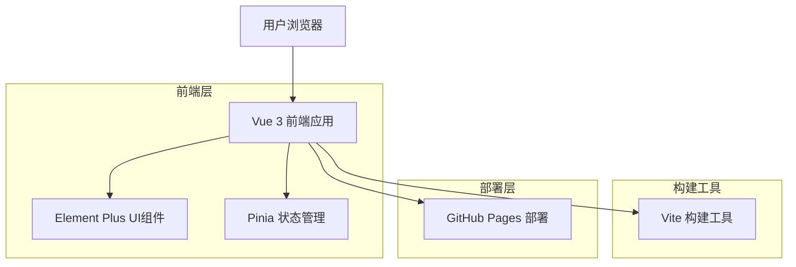

## 1. 架构设计



## 2. 技术描述

* **前端框架**: Vue 3 + Composition API

* **UI组件库**: Element Plus

* **状态管理**: Pinia

* **构建工具**: Vite

* **初始化工具**: vite-init

* **部署平台**: GitHub Pages

* **代码规范**: ESLint + Prettier

## 3. 路由定义

| 路由           | 用途                 |
| ------------ | ------------------ |
| /            | 首页，展示个人简介和链接卡片     |
| /project/:id | 项目详情页（可选），展示具体项目信息 |

## 4. 项目结构

```
szysammie.github.io/
├── public/
│   ├── favicon.ico
│   └── index.html
├── src/
│   ├── assets/
│   │   ├── images/
│   │   └── styles/
│   │       └── global.css
│   ├── components/
│   │   ├── PersonalProfile.vue
│   │   ├── LinkCard.vue
│   │   └── Footer.vue
│   ├── views/
│   │   └── HomePage.vue
│   ├── stores/
│   │   └── profile.js
│   ├── router/
│   │   └── index.js
│   ├── utils/
│   │   └── constants.js
│   ├── App.vue
│   └── main.js
├── .gitignore
├── package.json
├── vite.config.js
└── README.md
```

## 5. 组件设计

### 5.1 主要组件

* **PersonalProfile.vue**: 个人简介组件，显示头像、姓名、职业和简介

* **LinkCard.vue**: 链接卡片组件，可复用的卡片布局

* **HomePage.vue**: 首页主组件，组合其他子组件

### 5.2 状态管理

使用Pinia管理全局状态：

```javascript
// stores/profile.js
export const useProfileStore = defineStore('profile', {
  state: () => ({
    name: 'Sammie',
    title: 'Full Stack Developer',
    description: '热爱技术，专注于前端开发和用户体验设计',
    avatar: '/avatar.jpg',
    links: [
      {
        id: 1,
        title: 'GitHub',
        description: '查看我的开源项目',
        url: 'https://github.com/szysammie',
        icon: 'github'
      },
      {
        id: 2,
        title: '博客',
        description: '阅读我的技术文章',
        url: 'https://blog.sammie.vip',
        icon: 'document'
      }
    ]
  })
})
```

## 6. 样式设计

### 6.1 全局样式

```css
/* 渐变背景 */
body {
  background: linear-gradient(135deg, #667eea 0%, #764ba2 100%);
  min-height: 100vh;
}

/* 卡片样式 */
.link-card {
  backdrop-filter: blur(10px);
  background: rgba(255, 255, 255, 0.1);
  border: 1px solid rgba(255, 255, 255, 0.2);
  transition: all 0.3s ease;
}

.link-card:hover {
  transform: translateY(-5px);
  box-shadow: 0 10px 30px rgba(0, 0, 0, 0.2);
}
```

### 6.2 响应式断点

* 移动端: < 768px

* 平板端: 768px - 1024px

* 桌面端: > 1024px

## 7. GitHub Pages 配置

### 7.1 Vite配置

```javascript
// vite.config.js
import { defineConfig } from 'vite'
import vue from '@vitejs/plugin-vue'

export default defineConfig({
  plugins: [vue()],
  base: '/', // GitHub Pages用户站点需要设置为 '/'
  build: {
    outDir: 'dist'
  }
})
```

### 7.2 部署脚本

在package.json中添加部署脚本：

```json
{
  "scripts": {
    "build": "vite build",
    "deploy": "npm run build && gh-pages -d dist"
  }
}
```

## 8. 性能优化

* 使用Vite的代码分割功能

* 图片懒加载

* CSS和JS文件压缩

* 使用CDN加速静态资源

* 启用Gzip压缩

## 9. 开发规范

* 使用ESLint进行代码检查

* 使用Prettier进行代码格式化

* 组件命名采用PascalCase

* 文件命名采用kebab-case

* 提交信息遵循Conventional Commits规范

